# RTL-to-GDS Implementation – Digital Alarm Clock with FSM-Based Control

A fully synchronous digital alarm clock implemented in Verilog HDL and taken through a complete RTL-to-GDS implementation flow — simulation, functional verification, logic synthesis, physical design, timing closure, and final GDSII generation — using Cadence NCLaunch, Cadence Genus, and Cadence Innovus.

---

## Project Overview

The design is an 8-bit-style register clock (5-bit hour, 6-bit minute, 6-bit second) with an alarm function. A time-keeping datapath increments hour/minute/second on a generated 1-second tick, while a separate alarm path lets a user latch a target alarm time and raises an `alarm_on` output when the clock time matches it. The whole design runs on a single clock domain.

## Objectives

- Design a fully synchronous digital alarm clock in Verilog HDL, with RTL cleanly separated into combinational and sequential blocks.
- Implement alarm control as an explicit finite state machine.
- Carry the design through a complete RTL-to-GDS flow and verify it at each stage.

## Key Features

- Fully synchronous RTL, single clock domain (`clk`), synchronous `reset`.
- Modular architecture: independent time-generation, time-counting, key-synchronization, alarm-register, and alarm-control blocks.
- FSM-based alarm controller (see [FSM-Based Alarm Controller](#fsm-based-alarm-controller)).
- RTL functional simulation and coverage analysis (Cadence NCLaunch / SimVision / IMC).
- Logic synthesis to a 336-cell gate-level netlist (Cadence Genus).
- Physical implementation — floorplanning, placement, clock-tree synthesis, routing, and timing closure (Cadence Innovus) — with 0 setup/hold violations post-route.
- Final GDSII layout.

---

## Architecture

```text
                 alarm_set ──► key_register (kr) ──► alarm_set_sync
                                                            │
              set_hour/set_min/set_sec ──────────────────► │
                                                            ▼
                                                   alarm_register (ar)
                                                            │
                                          alarm_hour/alarm_min/alarm_sec, alarm_enable
                                                            │
   clk ──► time_generator (tg) ──tick_1s──► time_counter (tc) ──hour/min/sec──► alarm_controller (ac) ──► alarm_on
```

`time_generator` divides `clk` down to a 1 Hz tick; `time_counter` uses that tick to keep hour/minute/second. In parallel, `key_register` synchronizes the `alarm_set` button press, and `alarm_register` latches the requested alarm time into `alarm_hour`/`alarm_min`/`alarm_sec` and asserts `alarm_enable`. `alarm_controller` compares the live time against the latched alarm time and drives `alarm_on`.

## FSM-Based Alarm Controller

`alarm_controller.v` implements the alarm logic as an explicit 4-state FSM (2-bit `state` register):

```text
localparam IDLE       = 2'b00,
           WAIT_MATCH = 2'b01,
           ALARM_ON_S = 2'b10,
           ALARM_OFF  = 2'b11;
```

| State | Behavior |
|---|---|
| `IDLE` | `alarm_on = 0`. Moves to `WAIT_MATCH` once `alarm_enable` is asserted. |
| `WAIT_MATCH` | `alarm_on = 0`. Compares `{hour,min,sec}` against `{alarm_hour,alarm_min,alarm_sec}` every cycle; on a match, moves to `ALARM_ON_S` and loads a 2-bit down-counter (`alarm_cnt = 2`). |
| `ALARM_ON_S` | `alarm_on = 1`. Decrements `alarm_cnt` each cycle; when it reaches 0, moves to `ALARM_OFF`. |
| `ALARM_OFF` | `alarm_on = 0`. Returns to `WAIT_MATCH` to wait for the next match. |

> **Note:** the states implemented in RTL are `IDLE / WAIT_MATCH / ALARM_ON_S / ALARM_OFF` (verified directly from `alarm_controller.v`), rather than a 3-state `IDLE/SET/ALARM` naming — this README documents the FSM exactly as coded.

---

## RTL Design

All source is synthesizable Verilog HDL, in [`RTL/`](RTL/):

| File | Role |
|---|---|
| [`alarm_clock_top.v`](RTL/alarm_clock_top.v) | Top-level module; instantiates and wires the five sub-modules below. |
| [`time_generator.v`](RTL/time_generator.v) | Divides `clk` down to a `tick_1s` pulse. |
| [`time_counter.v`](RTL/time_counter.v) | Keeps `hour`/`min`/`sec` using `tick_1s`. |
| [`key_register.v`](RTL/key_register.v) | Synchronizes the `alarm_set` input (`alarm_set` → `alarm_set_sync`). |
| [`alarm_register.v`](RTL/alarm_register.v) | Latches `set_hour`/`set_min`/`set_sec` into `alarm_hour`/`alarm_min`/`alarm_sec` on `alarm_set_sync`; drives `alarm_enable`. |
| [`alarm_controller.v`](RTL/alarm_controller.v) | FSM described above; drives `alarm_on`. |
| [`alarm_clock_tb.v`](RTL/alarm_clock_tb.v) | Testbench for `alarm_clock_top`. |

## Module Hierarchy

```text
alarm_clock_top
├── time_generator   (tg)
├── time_counter     (tc)
├── key_register     (kr)
├── alarm_register   (ar)
└── alarm_controller (ac)
```

---

## Simulation and Verification

RTL simulation was run with Cadence's Xcelium/Incisive simulator (`ncvlog` → `ncelab` → `ncsim`), driven through **Cadence NCLaunch**, with waveforms viewed in **SimVision**. Logs for each step are in [`Simulation/`](Simulation/).

<p align="center">
  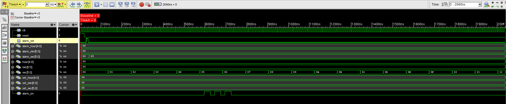
</p>

<p align="center">
  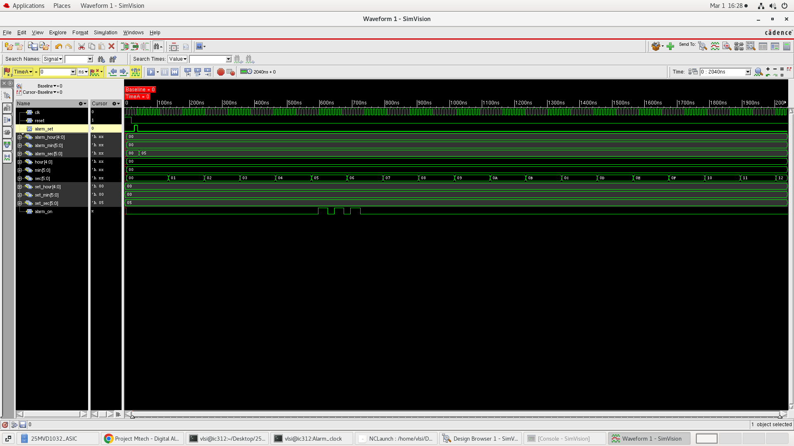
</p>

### Cadence NCLaunch

<p align="center">
  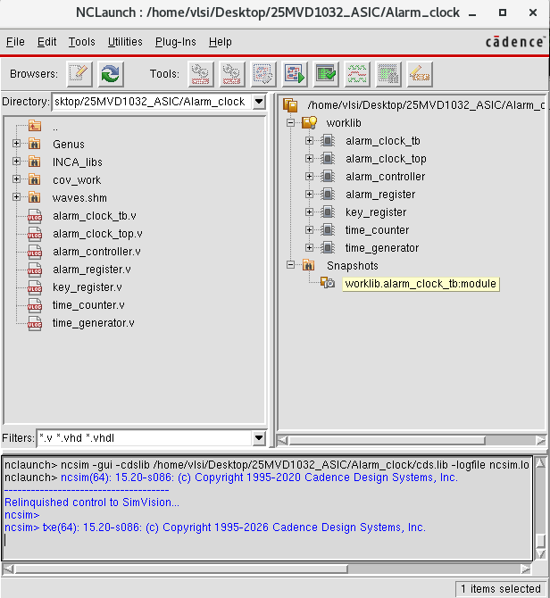
</p>

A Cadence IMC (Integrated Metrics Center) coverage run over the testbench reports **100% FSM coverage (16/16)**, alongside partial code coverage (Block 92.99%, Expression 50%, Toggle 23.35%; overall code coverage 53.61%, overall average grade 56.12%):

<p align="center">
  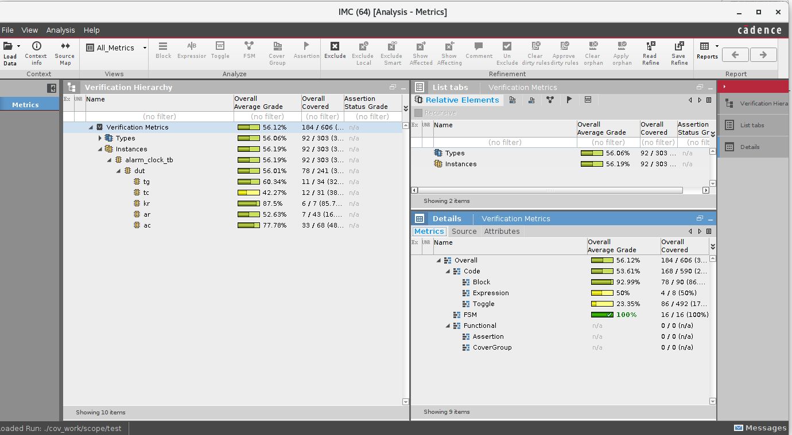
</p>

---

## Logic Synthesis – Cadence Genus

RTL was synthesized to the `slow` timing library (`slow (balanced_tree)` operating conditions, `enclosed` wireload mode) using the script [`Genus/gcd_run.tcl`](Genus/gcd_run.tcl):

```tcl
read_libs slow.lib
read_hdl alarm_clock_top.v
read_hdl alarm_controller.v
read_hdl alarm_register.v
read_hdl time_counter.v
read_hdl time_generator.v
elaborate
read_sdc alarm_constraints.g
syn_generic
syn_map
syn_opt
```

<p align="center">
  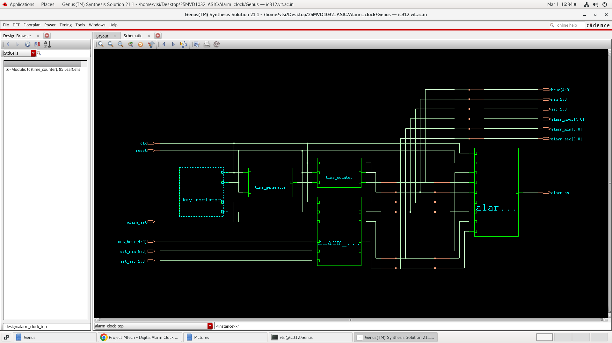
</p>

### Gate-Level Design (per module)

<p align="center">
  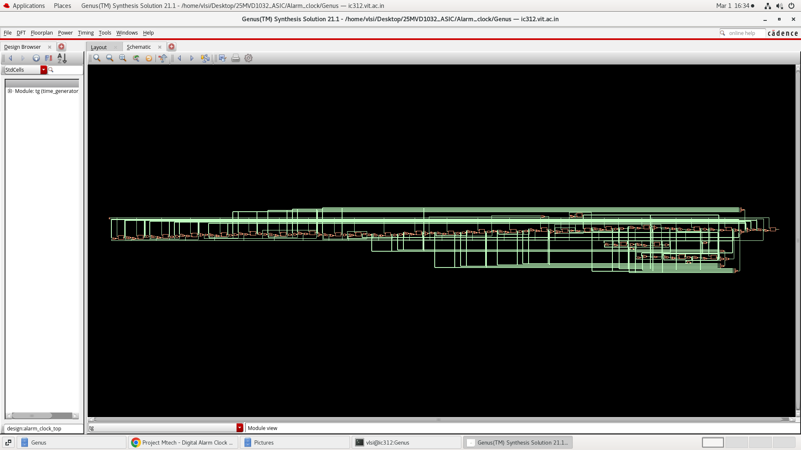
</p>
<p align="center">
  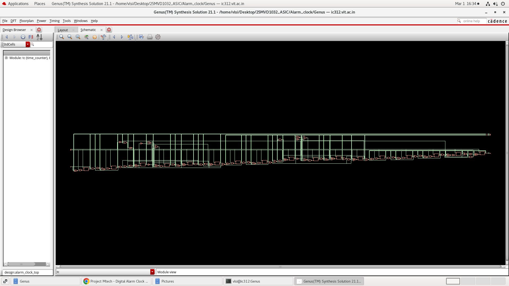
</p>
<p align="center">
  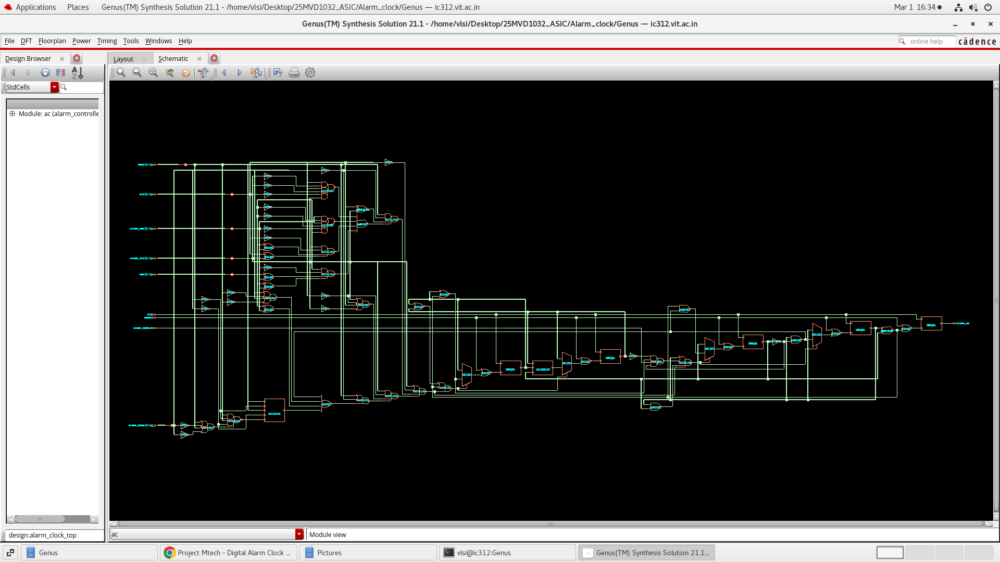
</p>
<p align="center">
  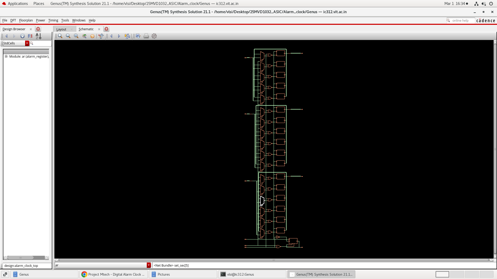
</p>

### Mapped Gates

<p align="center">
  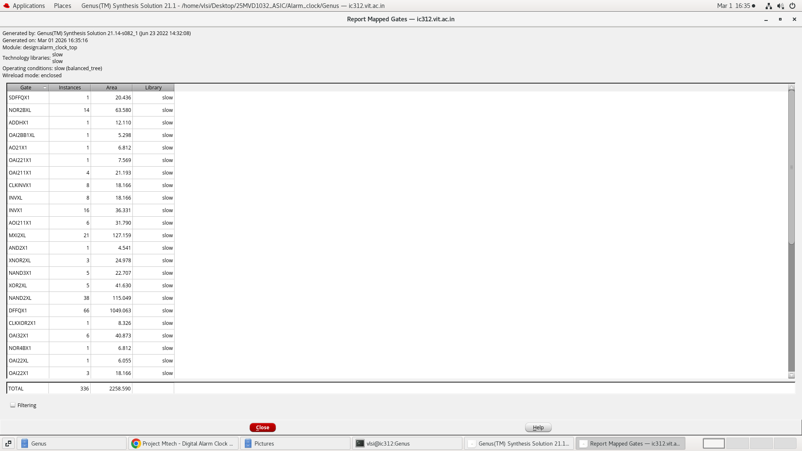
</p>
<p align="center">
  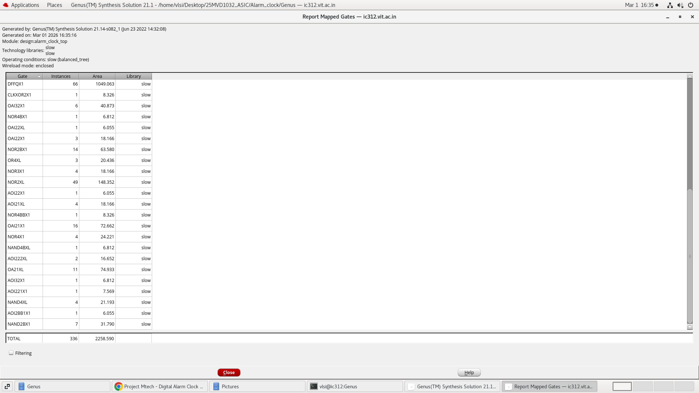
</p>

### Gate Count

<p align="center">
  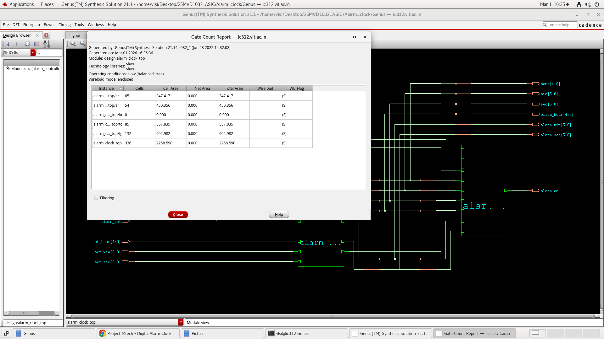
</p>

### Netlist Statistics

<p align="center">
  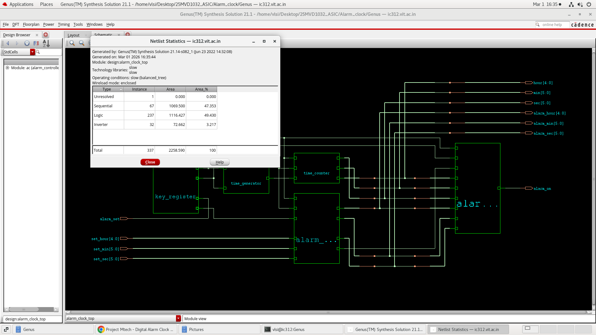
</p>

<p align="center">
  
</p>

### Synthesis Results

Per-module cell count and area, from [`Genus/gate_counter.rpt`](Genus/gate_counter.rpt):

| Module (instance) | Cells | Area |
|---|---:|---:|
| `alarm_controller` (`ac`) | 65 | 347.417 |
| `alarm_register` (`ar`) | 54 | 450.356 |
| `key_register` (`kr`) | 0 | 0.000 |
| `time_counter` (`tc`) | 85 | 557.835 |
| `time_generator` (`tg`) | 132 | 902.982 |
| **`alarm_clock_top` (total)** | **336** | **2258.590** |

Cell-type breakdown, from [`Genus/area_counter.rpt`](Genus/area_counter.rpt):

| Type | Instances | Area | Area % |
|---|---:|---:|---:|
| Sequential | 67 | 1069.500 | 47.4 |
| Logic | 237 | 1116.428 | 49.4 |
| Inverter | 32 | 72.662 | 3.2 |
| Unresolved | 1 | 0.000 | 0.0 |
| **Total** | **337** | **2258.590** | **100.0** |

(Area values are Genus's reported cell-area units; no unit label is printed in the reports.)

Genus pre-layout static timing analysis ([`Genus/timing_counter.rpt`](Genus/timing_counter.rpt)) reports the worst setup path as **MET**, with **6797 ps (6.797 ns) slack** at a 10000 ps (10 ns / 100 MHz) clock, from `tc/sec_reg[0]/CK` to `tc/hour_reg[4]/D`.

## Power Analysis

Genus reports power both before VCD annotation (activity-unaware / vectorless estimate) and after annotating switching activity from `alarm_clock.vcd`:

<p align="center">
  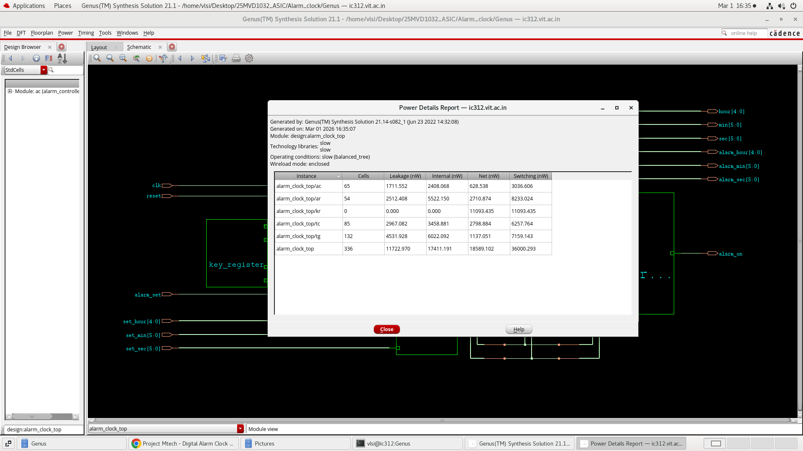
</p>
<p align="center">
  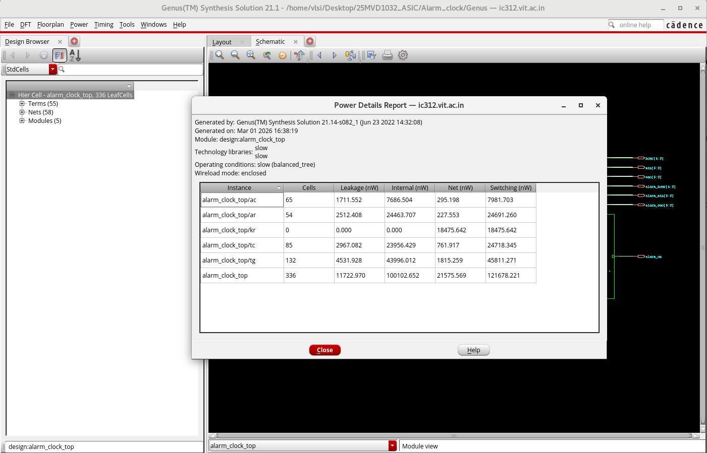
</p>

| Report (`alarm_clock_top` total, 336 cells) | Leakage (nW) | Internal (nW) | Net (nW) | Switching (nW) |
|---|---:|---:|---:|---:|
| Pre-VCD (vectorless) | 11722.970 | 17411.191 | 18589.102 | 36000.293 |
| VCD-annotated | 11722.970 | 100102.652 | 21575.569 | 121678.221 |

Leakage is identical between the two reports (it does not depend on switching activity); internal, net, and switching power are higher once real toggle activity from simulation is annotated.

## Timing Analysis

Post-route static timing was analyzed in Cadence Innovus (`timeDesign -postRoute`, [`Innovus_2_final/timingReports/`](Innovus_2_final/timingReports/)):

| Stage | Setup WNS (ns) | Setup TNS (ns) | Setup violating paths | Hold WNS (ns) | Hold TNS (ns) | Hold violating paths |
|---|---:|---:|---:|---:|---:|---:|
| Pre-CTS | +6.447 | 0.000 | 0 | −0.216 | −8.753 | 66 |
| Post-CTS (after hold `optDesign`) | +4.512 | 0.000 | 0 | 0.000 | 0.000 | 0 |
| Post-Route | +4.038 | 0.000 | 0 | +0.004 | 0.000 | 0 |

(All paths: 102 total, 67 reg2reg, 52 default, consistent across stages.)

The pre-CTS hold analysis showed 66 violating paths before the clock tree existed; running `optDesign -postCTS -hold` resolved all of them, and the design remained hold-clean through final routing. Setup timing stayed positive-slack and violation-free at every stage.

## Physical Design – Cadence Innovus

Placement was performed and iterated across three Innovus working directories ([`Innovus/`](Innovus/), [`Innovus_1/`](Innovus_1/), [`Innovus_2_final/`](Innovus_2_final/)) using Cadence Innovus 21.15.

<p align="center">
  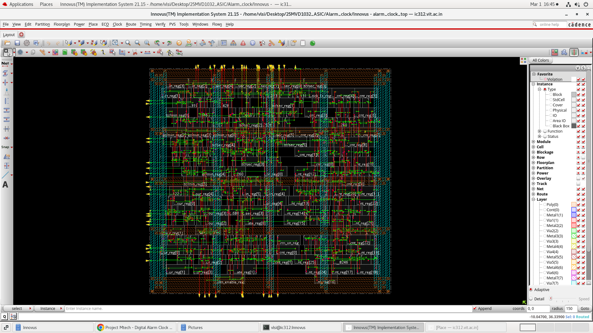
</p>
<p align="center">
  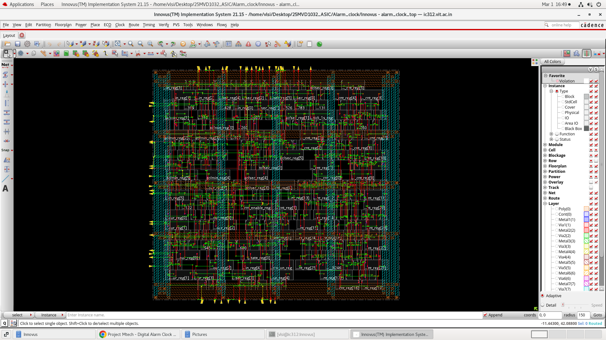
</p>

Final placement density was **94.530%** (100% with filler cells). Deliverables from the final (`Innovus_2_final`) run include the routed netlist ([`alarm_clock_top_nl.v`](Innovus_2_final/alarm_clock_top_nl.v)), parasitics ([`alarm_clock_top.spef`](Innovus_2_final/alarm_clock_top.spef)), and the constraint file used ([`alarm_constraints_1.sdc`](Innovus_2_final/alarm_constraints_1.sdc)).

## Final GDSII

The final physical layout (`alarm_without_timing_violation.gds`, in [`Innovus_2_final/`](Innovus_2_final/)) was streamed out with 0 setup/hold violations, per the timing results above.

<p align="center">
  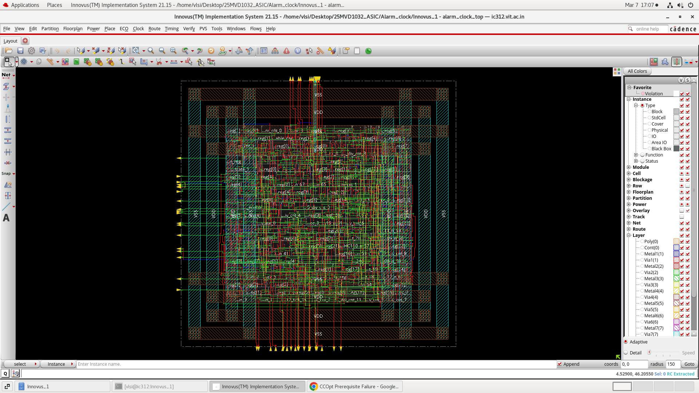
</p>

---

## Complete RTL-to-GDS Flow

```text
Verilog RTL (RTL/)
        │
        ▼
RTL Simulation (NCLaunch / Xcelium — ncvlog → ncelab → ncsim)
        │
        ▼
Functional Verification (SimVision waveforms, Cadence IMC coverage)
        │
        ▼
Logic Synthesis (Cadence Genus — syn_generic → syn_map → syn_opt)
        │
        ▼
Gate-Level Netlist (Genus/alarm_netlist.v)
        │
        ▼
Cadence Innovus — Floorplan / Placement
        │
        ▼
Clock Tree Synthesis + Hold Optimization (optDesign -postCTS -hold)
        │
        ▼
Routing
        │
        ▼
Post-Route Timing Closure (0 setup/hold violations)
        │
        ▼
GDSII (alarm_without_timing_violation.gds)
```

## Results Summary

| Metric | Result |
|---|---:|
| Total synthesized cells | 336 |
| Total cell area (Genus units) | 2258.590 |
| Sequential / Logic / Inverter cells | 67 / 237 / 32 |
| Genus pre-layout worst setup slack | +6.797 ns @ 10 ns clock (MET) |
| Post-route setup WNS / TNS | +4.038 ns / 0.000 ns |
| Post-route hold WNS / TNS | +0.004 ns / 0.000 ns |
| Post-route violating paths (of 102) | 0 |
| Pre-CTS hold violating paths | 66 (resolved by post-CTS hold optimization) |
| Final placement density | 94.530% (100% with fillers) |
| Functional (FSM) coverage | 100% (16/16), Cadence IMC |
| Final GDSII | `alarm_without_timing_violation.gds` |

---

## Repository Structure

```text
RTL-to-GDS-Digital-Alarm-Clock/
├── README.md
├── .gitignore
│
├── RTL/                          # Verilog source + testbench
│   ├── alarm_clock_top.v
│   ├── alarm_controller.v
│   ├── alarm_register.v
│   ├── key_register.v
│   ├── time_counter.v
│   ├── time_generator.v
│   └── alarm_clock_tb.v
│
├── Simulation/                   # Simulation run artifacts
│   ├── alarm_clock.vcd
│   ├── cds.lib
│   ├── hdl.var
│   ├── ncelab.log / ncsim.log / ncvlog.log / imc.log / mdv.log
│   └── cov_work/                 # Cadence IMC coverage database
│
├── Images/                       # Top-level project screenshots
│   ├── Simulation_Waveform.png
│   ├── Simulation_Waveform_1.png
│   ├── NCLaunch.png
│   ├── NCLaunch_1.png
│   └── Final_GDS.png
│
├── Genus/                        # Cadence Genus synthesis workspace
│   ├── fv/                       # Formal-verification (LEC) RTL-to-netlist mapping setup
│   ├── Outputs/                  # 12 synthesis screenshots (elaborated/gate-level/mapped gates/reports)
│   ├── gcd_run.tcl / gcd_run_vcd.tcl
│   ├── genus.cmd / genus.cmd1 / genus.log / genus.log1
│   ├── alarm_constraints.g / alarm_constraints_1.sdc / alarm_constraints_1_vcd.sdc
│   ├── alarm_netlist.v / alarm_netlist_vcd.v
│   ├── area_counter.rpt / gate_counter.rpt / power_counter.rpt / timing_counter.rpt (+ *_vcd variants)
│   └── alarm_clock_top.v, alarm_controller.v, alarm_register.v, time_counter.v, time_generator.v, alarm_clock_tb.v, alarm_clock.vcd
│                                  # (Genus's own working copies, read via init_hdl_search_path)
│
├── Innovus/                      # First Innovus placement pass
│   ├── PLacement.png / Placement_after.png
│   └── (.enc checkpoints, scripts, reports — .enc.dat databases excluded, see .gitignore)
│
├── Innovus_1/                    # Second Innovus pass
│   └── (.enc checkpoints, scripts, reports)
│
└── Innovus_2_final/               # Final, timing-clean Innovus pass
    ├── alarm_without_timing_violation.gds
    ├── alarm_clock_top_nl.v
    ├── alarm_clock_top.spef
    ├── alarm_constraints_1.sdc
    ├── timingReports/             # Pre-CTS / post-CTS / post-route setup+hold reports
    └── cts/
```

## Tools and Technologies

| Category | Tool |
|---|---|
| RTL | Verilog HDL |
| Simulation | Xilinx Vivado, Cadence NCLaunch (Xcelium/Incisive: `ncvlog`/`ncelab`/`ncsim`) |
| Waveform viewer | Cadence SimVision |
| Coverage analysis | Cadence IMC |
| Logic synthesis | Cadence Genus 21.14 |
| Physical design | Cadence Innovus 21.15 |

## How to Use

1. Review the RTL in [`RTL/`](RTL/), starting from `alarm_clock_top.v`.
2. Simulate `alarm_clock_tb.v` with `alarm_clock_top.v` and its sub-modules using a Verilog simulator; the original run used Cadence NCLaunch (`ncvlog` → `ncelab` → `ncsim`).
3. Inspect the simulation waveform (`Simulation/alarm_clock.vcd`) in a waveform viewer (e.g. SimVision or GTKWave).
4. Run logic synthesis with Cadence Genus using [`Genus/gcd_run.tcl`](Genus/gcd_run.tcl) (reads `slow.lib`, the RTL, and `alarm_constraints.g`; writes `alarm_netlist.v` and the `*_counter.rpt` reports).
5. Review the synthesis reports and images in [`Genus/Outputs/`](Genus/Outputs/).
6. Take the synthesized netlist into Cadence Innovus for floorplanning, placement, clock-tree synthesis, and routing (see [`Innovus_2_final/`](Innovus_2_final/) for the final, timing-clean run).
7. Review post-route timing in [`Innovus_2_final/timingReports/`](Innovus_2_final/timingReports/).
8. The final GDSII is `Innovus_2_final/alarm_without_timing_violation.gds`.

## Project Files

- RTL and testbench: [`RTL/`](RTL/)
- Simulation logs and VCD: [`Simulation/`](Simulation/)
- Synthesis scripts, reports, and screenshots: [`Genus/`](Genus/)
- Physical design runs, reports, and final GDSII: [`Innovus/`](Innovus/), [`Innovus_1/`](Innovus_1/), [`Innovus_2_final/`](Innovus_2_final/)

## Future Improvements

No documented future-work plan exists in the project files; none is claimed here.

## Author

**Manchikanti Surya Vardhan**
Vellore Institute of Technology
